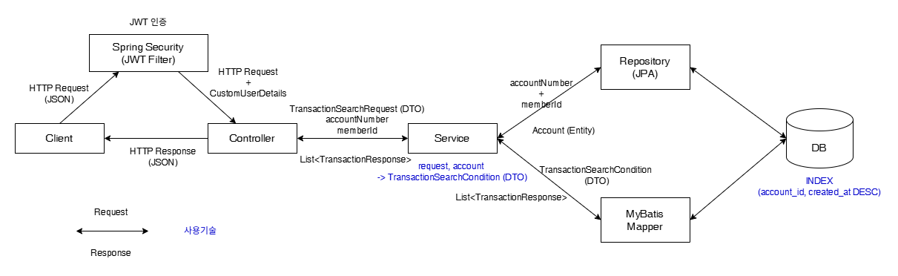
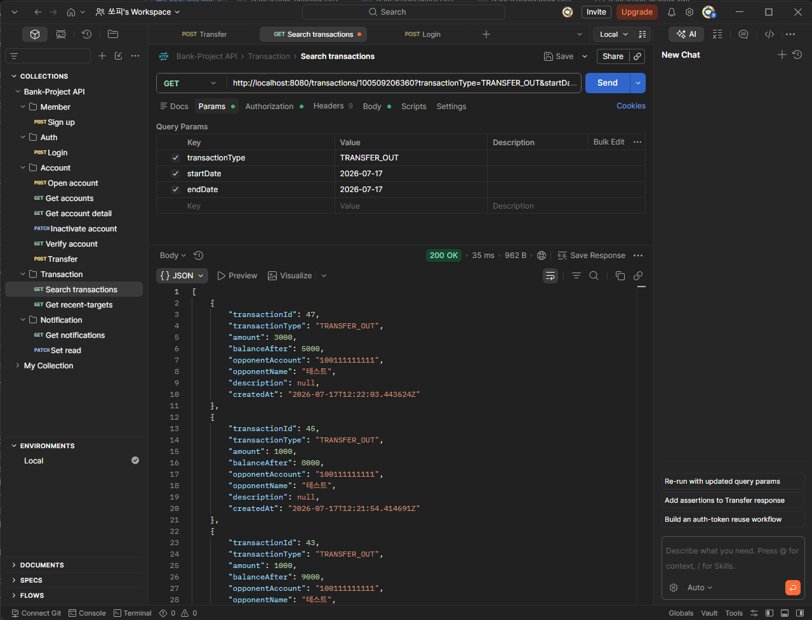
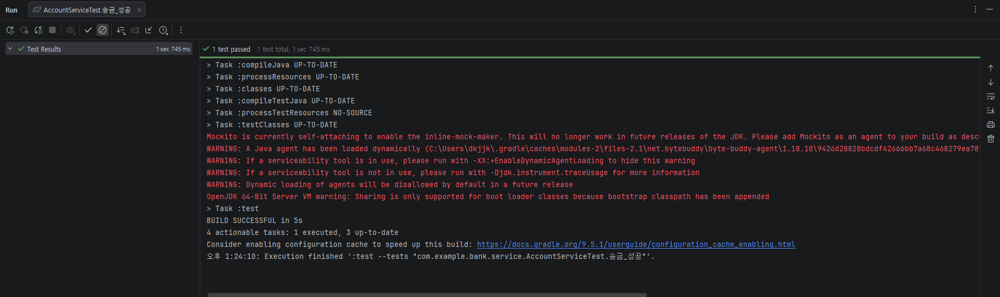
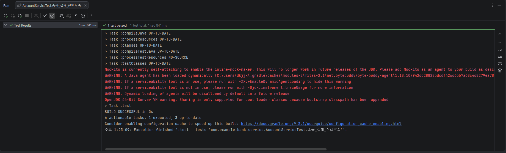
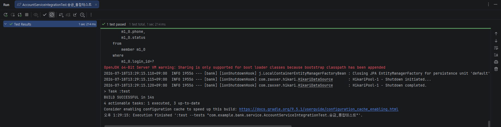
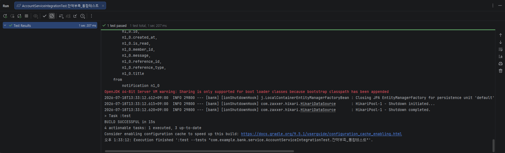

# 웹 뱅킹 백엔드 프로젝트
회원가입, JWT 기반 로그인, 계좌 개설 및 조회, 송금 기능을 중심으로 트랜잭션 관리, 동시성 제어, 이벤트 기반 알림, Trigger 기반 감사 로그를 적용하여 웹 백엔드 시스템을 설계하고 구현하였습니다

[bank backend 코드 바로가기](src/main/java/com/example/bank)

## 업데이트
- **26.07.20**
  - 백엔드 구현 및 테스트
- **26.07.22**
  - Docker & Docker Compose Deployment 로컬 테스트
- **26.07.23**
  - GitHub Actions CI 추가
  - Dockerfile, docker.yml 변경 및 추가 
  - docker-compose.yml 수정 후 AWS EC2 연결

## 기술 스택

### Backend
- Java 25
- Spring Boot
- Spring Security
- Spring Data JPA
- MyBatis

### Database
- PostgreSQL

### Test
- JUnit5
- Mockito
- Spring Boot Test

### DevOps
- Git / GitHub

### Tools
- IntelliJ IDEA
- pgAdmin
- Postman
- Flyway

## 구현 기능

### 사용자
- 회원가입 
- 로그인 (JWT 발급 및 인증)

### 계좌
- 계좌 개설
- 내 계좌 조회 (1:N)
- 계좌 상세 조회
- 계좌 해지 (비활성화)
- 예금주 조회
- 송금
  - @Transactional 기반 원자성 보장
  - Pessimistic Lock 이용한 동시성 제어
  - Event + Listener 통한 입출금 알림 생성

### 거래
- 거래내역 조회 (Mybatis)
- 최근 거래 상대 조회 (Mybatis)

### 알림
- 송금 알림 조회
- 알림 읽음 처리

### 로그
- Trigger 이용한 Audit Log 자동 기록

## ERD


## DB 설계
잦은 마이그레이션으로 코드 상 DB 스키마 파악에 어려움이 있어 readme에 정리하였습니다.

### member
| Column | Type |                                      |
|--------|------|--------------------------------------|
| id | BIGINT | PK, generated by default as identity |
| login_id | VARCHAR(30) | not null / unique                    |
| password | VARCHAR(255) | not null                             |
| name | VARCHAR(30) | not null                             |
| phone | VARCHAR(11) | not null                             |
| email | VARCHAR(100) | unique                               |
| status | VARCHAR(20) | not null / default ACTIVE            |
| created_at | TIMESTAMPTZ | not null / default NOW()             |

### account
| Column         | Type        |                                      |
|----------------|-------------|--------------------------------------|
| id             | BIGINT      | PK, generated by default as identity |
| member_id      | BIGINT      | FK, not null                         |
| account_number | VARCHAR(12) | not null / unique                    |
| balance        | BIGINT      | not null / default 0                 |
| status         | VARCHAR(20) | not null                             |
| created_at     | TIMESTAMPTZ | not null / default NOW()             |
| closed_at      | TIMESTAMPTZ |                                      |


### transaction_history
| Column           | Type        |                              |
|------------------|-------------|------------------------------|
| id               | BIGINT      | PK, generated by default as identity |
| account_id       | BIGINT      | FK, not null                 |
| type             | VARCHAR(20) | not null                  |
| amount           | BIGINT      | not null                 |
| balance_after    | BIGINT      | not null                 |
| opponent_account | VARCHAR(12) |             |
| opponent_name    | VARCHAR(30) |                              |
| desciption | VARCHAR(100) | |
| created_at     | TIMESTAMPTZ | not null / default NOW()             |

### notification
| Column         | Type         |                                      |
|----------------|--------------|--------------------------------------|
| id             | BIGINT       | PK, generated by default as identity |
| member_id      | BIGINT       | FK, not null                         |
| reference_type | VARCHAR(20)  | not null                             |
| reference_id   | BIGINT       | not null                             |
| title          | VARCHAR(100) | not null                             |
| message        | VARCHAR(255) | not null                             |
| is_read        | BOOLEAN      | not null / default false             |
| created_at     | TIMESTAMPTZ  | not null / default NOW()             |
- 무엇에 대한 알림인지는 reference_type + reference_id로 조회 -> 거래 이외에도 공지 등 여러 목적의 알림으로 확장 가능.

### audit_log (감사 로그)
| Column         | Type         |                                      |
|----------------|--------------|--------------------------------------|
| id             | BIGINT       | PK, generated by default as identity |
| table_name | VARCHAR(30) | not null |
| target_name | BIGINT | not null |
| action | varchar(10) | not null |
| created_at     | TIMESTAMPTZ  | not null / default NOW()             |

### CONSTRAINT
- chk_member_phone : 휴대폰 번호는 010 + 숫자 8자리로 구성.
- chk_member_status : 회원 상태는 ACTIVE, DORMANT, INACTIVE 중 하나.
- chk_account_account_number : 계좌번호는 12자리 숫자.
- chk_account_balance : 계좌 잔액은 양수이거나 0.
- chk_account_status : 계좌 상태는 ACTIVE, FROZEN, CLOSED 중 하나.
- chk_transaction_history_type : 거래 타입은 DEPOSIT, WITHDRAW, TRANSFER_IN, TRANSFER_OUT 중 하나.
- chk_transaction_history_amount : 거래 금액은 양수.
- chk_transaction_history_balance_after : 거래 후 잔액은 음수가 될 수 없다.
- chk_transaction_history_opponent_account : 거래 기록의 상대 계좌는 입/출금 일때 null, 송금 일때 12자리 숫자.
- chk_notification_reference_type : 알림의 참조 타입은 TRANSACTION, AUTO_TRANSFER 중 하나 (추후 확장 가능).
- chk_audit_log_table_name : 테이블 이름은 member, account, transaction_history, notification 중 하나. (테이블 추가 시 업데이트)
- chk_audit_log_action : 로그의 행동은 INSERT, UPDATE, DELETE 중 하나.

### INDEX
- idx_transaction_account_created : transaction_history에서 account_id, created_at(DESC)로 구성된 인덱스를 만들어 계좌별 거래내역 조회의 성능을 높임.
- idx_transaction_account_oppoonent_created : transaction_history에서 account_id, opponent_account, created_at DESC로 구성된 인덱스를 만들어 계좌별 최근 거래 상대 조회의 성능을 높임.

### TRIGGER
audit_log의 로그 자동 생성
- trg_member_audit : member에 INSERT, UPDATE 시
- trg_account_audit : account에 INSERT, UPDATE 시
- trg_transaction_audit : transaction_history에 INSERT 시
- trg_notification_audit : notification에 INSERT 시

## 프로젝트 구조


## API
| Domain | Method  | Endpoint                                                                     | Description |
|--------|---------|------------------------------------------------------------------------------|------------|
| Member | `POST`  | `/members`                                                                   | 회원가입       |
| Auth   | `POST`  | `/auth/login`                                                                | 로그인        |
| Account | `POST`  | `/accounts`                                                                  | 계좌 개설      |
| Account | `GET`   | `/accounts`                                                                  | 계좌 조회      |
| Account | `GET`   | `/accounts/{accountNumber}`                                                  | 계좌 상세 조회   |
| Account | `PATCH` | `/accounts/{accountNumber}`                                                  | 계좌 해지      |
| Account | `GET`   | `/accounts/verify?accountNumber={accountNumber}`                             | 예금주 조회     |
| Account | `POST`  | `/accounts/transfer`                                                         | 송금         |
| Transaction | `GET` | `/transactions/{accountNumber}`                                              | 거래내역 조회    |
| Transaction | `GET` | `/transactions/{accountNumber}/recent-targets` | 최근 거래 상대 조회 |
| Notification | `GET` | `/notifications`                                                             | 알림 내역 조회 |
| Notification | `PATCH` | `/notifications/{notificationId}`                                            | 알림 읽음 처리 |

## 핵심 기능

### 송금
로그인한 사용자가 자신의 계좌에서 다른 계좌로 송금하는 기능입니다


- JWT 로그인 인증 방식으로 서버의 자유를 보장
- @Transactional 사용으로 송금 과정의 원자성 보장
- Pessimistic Lock으로 동시 송금 방지
- EventListener는 AFTER_COMMIT으로 rollback 반영


송금 Postman 실행 결과

### 거래내역 조회
로그인한 사용자가 자신의 계좌별 거래내역을 조회하는 기능입니다. 거래타입이나 거래기간(시작/종료 날짜)를 선택할 수 있습니다.


```xml
<select id="findTransactions"
            parameterType="com.example.bank.dto.transaction.TransactionSearchCondition"
            resultType="com.example.bank.dto.transaction.TransactionResponse">

        SELECT
            id                  AS transactionId,
            type                AS transactionType,
            amount,
            balance_after       AS balanceAfter,
            opponent_account    AS opponentAccount,
            opponent_name       AS opponentName,
            description,
            created_at          AS createdAt
        FROM transaction_history
        WHERE account_id = #{accountId}

        <if test="transactionType != null">
            AND type = #{transactionType}
        </if>

        <if test="startDateTime != null">
            AND created_at &gt;= #{startDateTime}
        </if>

        <if test="endDateTime != null">
            AND created_at &lt;= #{endDateTime}
        </if>

        ORDER BY created_at DESC

        LIMIT #{limit}
        OFFSET #{offset}

    </select>
```
- Mybatis 사용하여 조회
- 동적 SQL 통해 거래타입, 거래기간, 페이지 등의 조건을 유연하게 처리
- 조회 성능을 위해 계좌와 거래일시 컬럼에 Index 적용


거래내역 조회 Postman 실행 결과

## 테스트
핵심 기능인 송금에 대하여 송금 성공과 잔액 부족으로 인한 실패를 Given / When /Then에 맞추어 테스트하였습니다.

### 단위 테스트
JUnit5 + Mockito

[`AccountServiceTest`](src/test/java/com/example/bank/service/AccountServiceTest.java)
- 송금_성공()
  
- 송금_실패_잔액부족()
  

### 통합 테스트
JUnit5 + Spring Boot Test

[`AccountServiceIntegrationTest`](src/test/java/com/example/bank/service/AccountServiceIntegrationTest.java)

환경변수 사용 : `DB_USERNAME`,`DB_PASSWORD`,`JWT_SECRET`

- 송금_통합테스트()
  
- 잔액부족_통합테스트()
  

## 트러블 슈팅
1. 송금 완료 후 Notifiaction 저장 실패
   - 문제 : EventListener는 송금 완료와 이벤트 발행이 rollback 없이 완료되고 실행되어야 하므로 @TransactionalEventListener(phase = TransactionPhase.AFTER_COMMIT)으로 구현하였습니다. 그러나, Commit이 되면 트랜잭션이 종료되어 Notification 저장이 불가능합니다.
   - 해결 : Notification 저장에 관해 NotificationService로 책임을 분리하고 NotificationService에 @Transactional(propagation = Propagation.REQUIRES_NEW)를 적용하여 Notification 저장 용 새로운 트랜잭션을 실행합니다.
   2. Docker + AWS EC2 배포 실패
   - 문제 : EC2 메모리 부족
   - 해결 : GitHub Actions에서 빌드 수행 -> Docker Hub에 Docker Image 저장 -> EC2에서는 다운받아서 실행

## 개선 및 확장
앞으로 본 프로젝트에 추가, 개선, 도입해나갈 사항들입니다.

### 개선
1. 핵심 기능(ex-송금)에 대한 모든 테스트 케이스 확인
   - 자기 자신에게 송금 : SameAccountTransferException 발생
   - 존재하지 않는 계좌로 송금 : AccountNotFoundException 발생
   - 계좌의 상태가 ACTIVE가 아님 : AccountUnavailableException 발생
   - 송금 금액이 0 이하 : 요청 시 validation에서 막히지만, Service에서 Exception 발생시킬 것.
2. Docker, AWS + Swagger로 패키징 및 배포 (진행 중)
3. CI/CD 도입으로 테스트-패키징-배포 자동화 (-> GitHub Actions)

### 확장
1. bank-front로 프론트엔드 개발
2. bank-project 기능 추가
   - member에 role 컬럼 추가 : 단순 현금 입출금, RAG 거래 통계 기능 추가 가능
     - ROLE_USER : 일반 사용자
     - ROLE_BANKER : 은행 창구
     - ROLE_ATM : ATM
     - ROLE_ADMIN : 관리자
   - 자동이체 기능 추가 : Scheduler + Batch
     - 자동이체 등록 및 해지
     - 자동이체 목록 및 상세 조회
3. bank-ai로 ai 기술 적용
   - RAG 거래내역 검색 : 기존의 거래내역 조회를 AI가 수행
   - AI Agnet 송금 : 기존의 송금 기능을 AI가 수행
