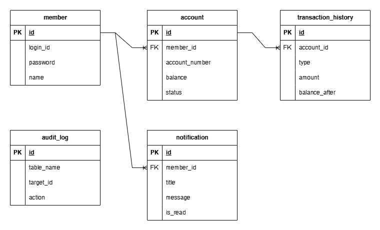
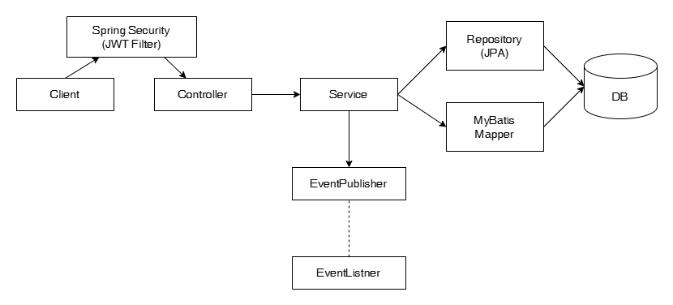
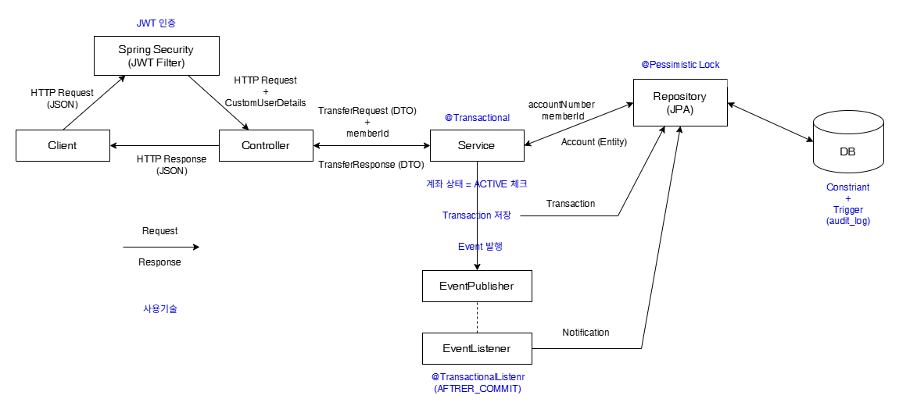
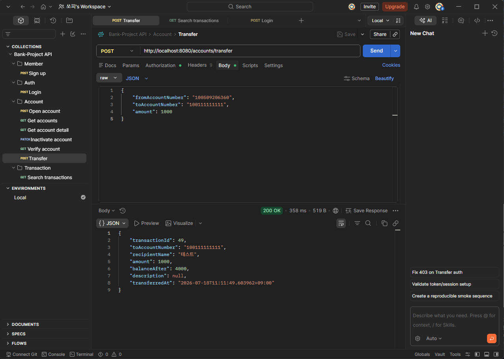

# 웹 뱅킹 백엔드 프로젝트
회원가입, JWT 기반 로그인, 계좌 개설 및 조회, 송금 기능을 중심으로 트랜잭션 관리, 동시성 제어, 이벤트 기반 알림, Trigger 기반 감사 로그를 적용하여 웹 백엔드 시스템을 설계하고 구현하였습니다.

## 기술 스택

### Backend
- Java 25
- Spring Boot
- Spring Security
- Spring Data JPA
- MyBatis

### Database
- PostgreSQL

### Test
- JUnit5
- Mockito
- Spring Boot Test

### DevOps
- Git / GitHub

### Tools
- IntelliJ IDEA
- pgAdmin
- Postman
- Flyway

## 주요 기능

### 사용자
- 회원가입 
- 로그인 (JWT 발급 및 인증)

### 계좌
- 계좌 개설
- 내 계좌 조회 (1:N)
- 계좌 상세 조회
- 계좌 해지 (비활성화)
- 예금주 조회
- 송금
  - @Transactional 기반 원자성 보장
  - Pessimistic Lock 이용한 동시성 제어
  - Event + Listener 통한 입출금 알림 생성

### 거래
- 거래내역 조회 (Mybatis)
- 최근 거래 상대 조회 (Mybatis)

### 알림
- 송금 알림 조회
- 알림 읽음 처리

### 로그
- Trigger 이용한 Audit Log 자동 기록

## ERD

## DB 설계
잦은 마이그레이션으로 코드 상 DB 스키마 파악에 어려움이 있어 readme에 정리하였습니다.

### member
- id : bigint / pk / generated by default as identity
- login_id : varchar(30) / not null / unique
- password : varchar(255) / not null
- name : varchar(30) / not null
- phone : varchar(11) / not null
- email : varchar(100) / unique
- status : varchar(20) / not null / default 'ACTIVE'
- created_at : timestamp with time-zone / not null / default now

### account
- id : ``
- member_id : fk / bigint / not null
- account_number : varchar(12) / not null / unique
- balance(현재 잔액) : / bigint / not null / default 0
- status(계좌 상태) : varchar(20) / not null
- created_at : ``
- closed_at(해지 날짜) : timestamp with time-zone

### transaction_history
- id : ``
- account_id : fk / bigint
- type : varchar(20) / not null
- amount : bigint / not null
- balance_after(거래 후 잔액, 스냅샷) : bigint / not null
- opponent_account(거래 상대 계좌번호) : varchar(12)
- opponent_name (거래 상대 이름) : varchar / not null
- description (메모) : varchar(100)
- created_at : ``

### notification
- id : ``
- member_id : fk / bigint / not null
- reference_type : varchar(20) / not null
- reference_id : bigint / not null
  - 무엇에 대한 알림인지는 reference_type + reference_id로 조회 -> 거래 이외에도 공지 등 여러 목적의 알림으로 확장 가능.
- title : varchar(100) / not null
- message : varchar(255)
- is_read(읽음 여부) : boolean / not null / default false
- created_at : ``

### audit_log (감사 로그)
- id : ``
- table_name : varchar(30) / not null
- target_id(해당 레코드 id) : bigint / not null
- action : varchar(10) / not null
- created_at : ``

### CONSTRAINT
- chk_member_phone : 휴대폰 번호는 010 + 숫자 8자리로 구성.
- chk_member_status : 회원 상태는 ACTIVE, DORMANT, INACTIVE 중 하나.
- chk_account_account_number : 계좌번호는 12자리 숫자.
- chk_account_balance : 계좌 잔액은 양수이거나 0.
- chk_account_status : 계좌 상태는 ACTIVE, FROZEN, CLOSED 중 하나.
- chk_transaction_history_type : 거래 타입은 DEPOSIT, WITHDRAW, TRANSFER_IN, TRANSFER_OUT 중 하나.
- chk_transaction_history_amount : 거래 금액은 양수.
- chk_transaction_history_balance_after : 거래 후 잔액은 음수가 될 수 없다.
- chk_transaction_history_opponent_account : 거래 기록의 상대 계좌는 입/출금 일때 null, 송금 일때 12자리 숫자.
- chk_notification_reference_type : 알림의 참조 타입은 TRANSACTION, AUTO_TRANSFER 중 하나 (추후 확장 가능).
- chk_audit_log_table_name : 테이블 이름은 member, account, transaction_history, notification 중 하나. (테이블 추가 시 업데이트)
- chk_audit_log_action : 로그의 행동은 INSERT, UPDATE, DELETE 중 하나.

### INDEX
- idx_transaction_account_created : transaction_history에서 account_id, created_at(DESC)로 구성된 인덱스를 만들어 계좌별 거래내역 조회의 성능을 높임.
- idx_transaction_account_oppoonent_created : transaction_history에서 account_id, opponent_account, created_at DESC로 구성된 인덱스를 만들어 계좌별 최근 거래 상대 조회의 성능을 높임.

### TRIGGER
audit_log의 로그 자동 생성
- trg_member_audit : member에 INSERT, UPDATE 시
- trg_account_audit : account에 INSERT, UPDATE 시
- trg_transaction_audit : transaction_history에 INSERT 시
- trg_notification_audit : notification에 INSERT 시

## 프로젝트 구조

## API
| Domain | Method  | Endpoint                                                                     | Description |
|--------|---------|------------------------------------------------------------------------------|------------|
| Member | `POST`  | `/members`                                                                   | 회원가입       |
| Auth   | `POST`  | `/auth/login`                                                                | 로그인        |
| Account | `POST`  | `/accounts`                                                                  | 계좌 개설      |
| Account | `GET`   | `/accounts`                                                                  | 계좌 조회      |
| Account | `GET`   | `/accounts/{accountNumber}`                                                  | 계좌 상세 조회   |
| Account | `PATCH` | `/accounts/{accountNumber}`                                                  | 계좌 해지      |
| Account | `GET`   | `/accounts/verify?accountNumber={accountNumber}`                             | 예금주 조회     |
| Account | `POST`  | `/accounts/transfer`                                                         | 송금         |
| Transaction | `GET` | `/transactions/{accountNumber}`                                              | 거래내역 조회    |
| Transaction | `GET` | `/transactions/{accountNumber}/recent-targets` | 최근 거래 상대 조회 |
| Notification | `GET` | `/notifications`                                                             | 알림 내역 조회 |
| Notification | `PATCH` | `/notifications/{notificationId}`                                            | 알림 읽음 처리 |

## 핵심 기능

### 송금
로그인한 사용자가 자신의 계좌에서 다른 계좌로 송금하는 기능입니다

- JWT 로그인 인증 방식으로 서버의 자유 보장. 
- @Transactional 사용으로 송금 과정에의 원자성 보장
- Pessimistic Lock으로 동시 송금 방지
- EventListener는 AFTER_COMMIT으로 rollback 반영

송금 기능의 Postman 실행 결과

### 거래내역 조회
로그인한 사용자가 자신의 계좌별 거래내역을 조회하는 기능입니다. 거래타입이나 거래기간(시작날짜/종료날짜)를 선택할 수 있습니다.

## 테스트

### 단위 테스트
JUnit5 + Mockito

### 통합 테스트
JUnit5 + Spring Boot Test

## 트러블 슈팅

## 개선 및 확장